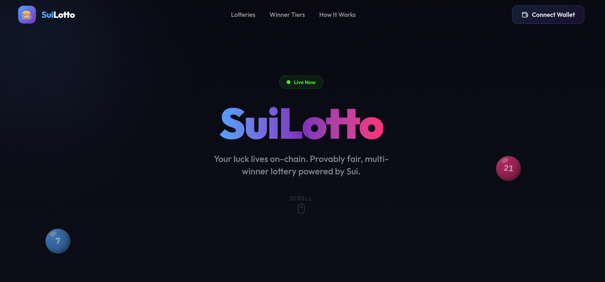

# SuiLotto

A decentralized multi-winner lottery on the Sui blockchain. Players buy tickets with SUI, and when the deadline hits, on-chain randomness picks the winners. 98% of the pool goes to winners, 2% to the protocol.



## Lottery Rules

### How It Works

1. Admin creates a lottery round with a ticket price and deadline
2. Players buy tickets by paying SUI — each payment is one ticket (buy as many as you want)
3. At least **2 participants** are required for a valid draw
4. After the deadline, the admin triggers the draw
5. Winners are randomly selected on-chain — more tickets = higher odds
6. If fewer than 2 players by deadline, participants can claim a **full refund**

### Winner Tiers

The number of winners scales with participation:

| Tickets Sold | Winners | Share Each |
| ------------ | ------- | ---------- |
| 2–5          | 1       | 100%       |
| 6–9          | 2       | 50%        |
| 10–99        | 3       | ~33.3%     |
| 100+         | 5       | 20%        |

The same address **can** win multiple times if they hold multiple tickets.

### Prize Split

| Recipient | Share |
| --------- | ----- |
| Winners   | 98%   |
| Protocol  | 2%    |

### Randomness

Winner selection uses Sui's native `sui::random` module — verifiable on-chain randomness that cannot be manipulated by anyone, including the admin.

## Getting Started

### Prerequisites

- [Node.js](https://nodejs.org/) v18+
- [pnpm](https://pnpm.io/), npm, or yarn

### Clone & Run

```bash
git clone https://github.com/your-username/sui-lotto-frontend.git
cd sui-lotto-frontend

# Install dependencies
npm install

# Start dev server
npm run dev
```

Open [http://localhost:3000](http://localhost:3000) in your browser.

### Build for Production

```bash
npm run build
npm start
```

## Tech Stack

- **Framework** — Next.js, React 19, TypeScript
- **Styling** — Tailwind CSS v4
- **Sui SDK** — @mysten/sui, @mysten/dapp-kit
- **State** — @tanstack/react-query
